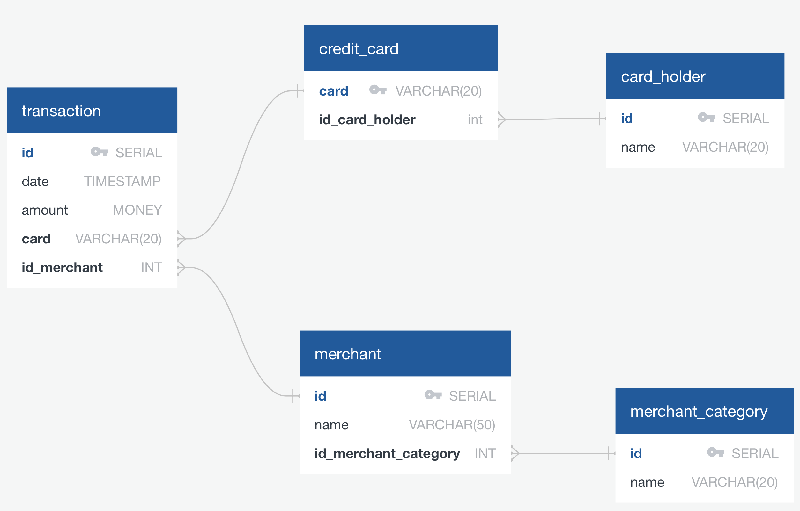
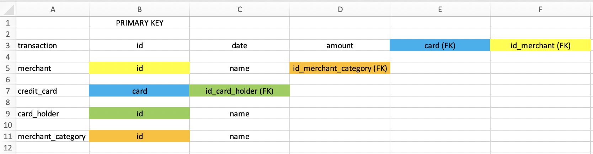

# Suspicious Transactions

####Entity Relationship Diagram (ERD):

I created the above ERD using QuickDBD and the following code: 
```
transaction
-
id PK SERIAL
date TIMESTAMP
amount MONEY
card VARCHAR(20) FK >- credit_card.card
id_merchant INT FK >- merchant.id

merchant
-
id PK SERIAL
name VARCHAR(50)
id_merchant_category INT FK >- merchant_category.id

credit_card 
-
card PK VARCHAR(20)
id_card_holder int FK >- card_holder.id

card_holder 
-
id PK SERIAL
name VARCHAR(20)

merchant_category
-
id PK SERIAL
name VARCHAR(20)
```

To figure out how many tables I needed to create, as well as what kind of relationships I needed to define among the tables, I looked at the five CSV files and created a simple color-coded spreadsheet to show linkages between Primary Keys and Foreign Keys:


I used the following code for the table schemata which can be viewed in "schema.sql":
```
DROP TABLE IF EXISTS transaction;
DROP TABLE IF EXISTS merchant;
DROP TABLE IF EXISTS credit_card;
DROP TABLE IF EXISTS card_holder;
DROP TABLE IF EXISTS merchant_category;

CREATE TABLE transaction (
	id SERIAL PRIMARY KEY NOT NULL,
	date TIMESTAMP NOT NULL,
	amount MONEY NOT NULL,
	card VARCHAR(20) NOT NULL,
	id_merchant INT
);

CREATE TABLE merchant (
	id SERIAL PRIMARY KEY NOT NULL,
	name VARCHAR(50) NOT NULL,
	id_merchant_category INT NOT NULL
);

CREATE TABLE credit_card (
	card VARCHAR(20) PRIMARY KEY NOT NULL,
	id_card_holder INT NOT NULL
);

CREATE TABLE card_holder (
	id SERIAL PRIMARY KEY NOT NULL,
	name VARCHAR(50) NOT NULL
);

CREATE TABLE merchant_category (
	id SERIAL PRIMARY KEY NOT NULL,
	name VARCHAR(20) NOT NULL
);

ALTER TABLE transaction
ADD FOREIGN KEY (card) REFERENCES credit_card (card);

ALTER TABLE transaction
ADD FOREIGN KEY (id_merchant) REFERENCES merchant (id);

ALTER TABLE credit_card
ADD FOREIGN KEY (id_card_holder) REFERENCES card_holder (id);

ALTER TABLE merchant
ADD FOREIGN KEY (id_merchant_category) REFERENCES merchant_category (id);
```

I then read the database into Python and ran my queries from within JupyterLab. Please reference "visual_data_analysis.ipynb" to see my queries and analysis.

